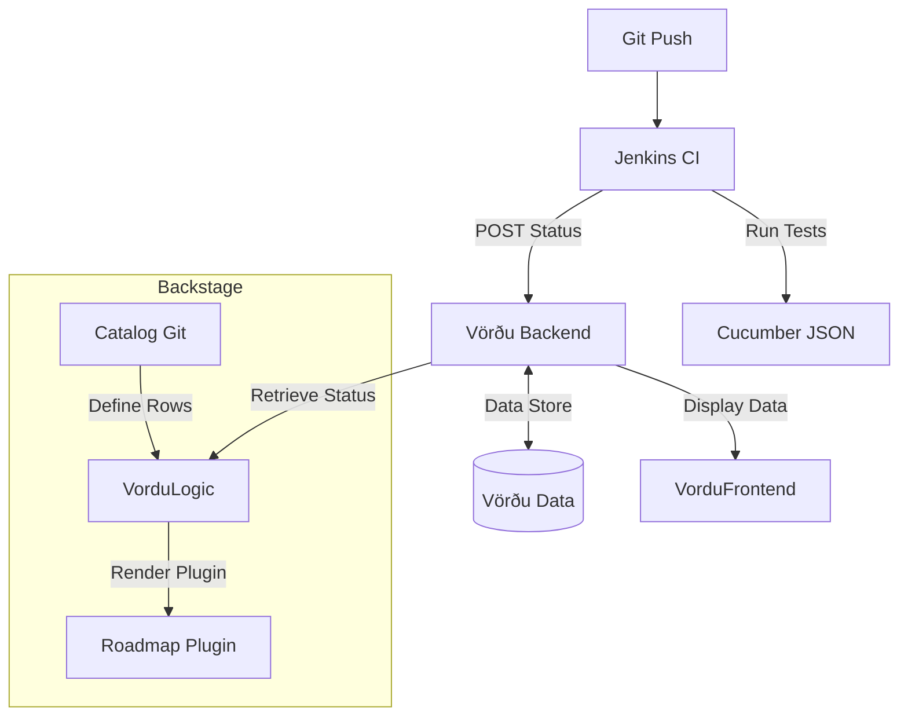

# Vörðu: The Living Roadmap Architecture

Visualizing progress via BDD tests categorized into a dynamic roadmap.

## The Core Concept

Instead of manually updating a Markdown table, **Vörðu** listens to your CI/CD pipelines and reads your Backstage Catalog.

* **The Spec**: BDD Feature files (`.feature`) define *what* should work.
* **The Structure**: Backstage Entities (`catalog-info.yaml`) define *where* it fits in the big picture.
* **The Status**: Automated Test Results (Cucumber JSON) define *what currently* works.
* **The Map**: Vörðu aggregates this into its Matrix view (and potentially a Backstage Plugin could do similar).

## Data Hierarchy

Instead of custom YAML or JSON, we start with standard **Backstage Entities** defined in `catalog-info.yaml` and overload with extra config as needed. They are organized in a tree, with the archetype project being Yggdrasil. The top defines 

### The Scope (Yggdrasil = Domain)

The **Domain Entity** defines the high-level roadmap container and the "Global Columns" (Phases - TODO: uncertain if sensible if projects get their own column headers). It also points to which projects we want to include in the roadmap.

```yaml
apiVersion: backstage.io/v1alpha1
kind: Domain
metadata:
  name: yggdrasil
  annotations:
    vordu.io/phases: "0:Foundation,1:Utility,2:Federation,3:Sovereignty"
```

### The Project (Project = System)

The **System Entity** represents a row group (e.g., "Demicracy"). It can define overrides for columns if needed.

* **Entity**: `kind: System` (e.g., `name: mimir`)
    * Note that a standalone Component should be usable as well, a System should not be required, but may be natural.
* **Role**: Groups multiple components into a single roadmap view.

### The Capabilities (Module = Component)

Each **Component Entity** represents a specific Row in the matrix.

```yaml
apiVersion: backstage.io/v1alpha1
kind: Component
metadata:
  name: kafka
  system: mimir
  annotations:
    vordu.io/row-label: "Event Streaming"
spec:
  type: service
  lifecycle: experimental
```

### Feature Mapping (BDD Tags)

We link Features to Backstage Components and optionally sub-components.

* *Tag Syntax*: `@component:[name]` `@phase:[0-3]`
* *Example*:
    ```gherkin
    @component:kafka @phase:1
    Feature: Manual Verification
    ```

## The Architecture



### Components

1. **Configuration (The Catalog)**: Vörðu reads local Backstage catalog files (not Backstage itself - just two systems using the same source files) to understand entity config to build the "Empty Matrix".
2. **Status (The Data)**: Jenkins pushes test results to `vordu-data` via the Vörðu API.
3. **Visualization (Standalone)**: A standalone Vörðu app merges the Catalog (Structure) with the DB (Color).
4. **Visualization (The Plugin)**: A custom Backstage plugin merges the Catalog (Structure) with the DB (Color).

## Workflow Example

1. **You write a feature**: `Feature: Kafka Event Streaming` tagged `@component:kafka @phase:1`.
2. **You push to Git**: The test fails (Red).
3. **Vörðu shows update**: The "Event Streaming / Phase 1" cell shows "0/1 Passing".
4. **Kafka component implemented**: You write the code.
5. **Jenkins runs**: The test passes (Green).
6. **Vörðu shows update**: The cell shows "1/1 Passing".

## Implementation Plan (Vörðu)

TODO: Update this to consider the current advanced state of the Vordu API already working, need to just redo how the map is defined in Backstage catalog files and updated by separate per-project Jenkinsfiles akin to how the Uplifted Mascot content repos works.

* [ ] **Step 1**: Define the `catalog-info.yaml` for Yggdrasil (Domain).
* [ ] **Step 2**: Create the **Vörðu API** (Microservice/Plugin) to parse Cucumber JSON.
* [ ] **Step 3**: Create the **Vörðu UI** (Plugin) to render the grid from Catalog data.
* [ ] **Step 4**: Wire up a sample Jenkins pipeline (using Uplifted Mascot's agent) to push data.
