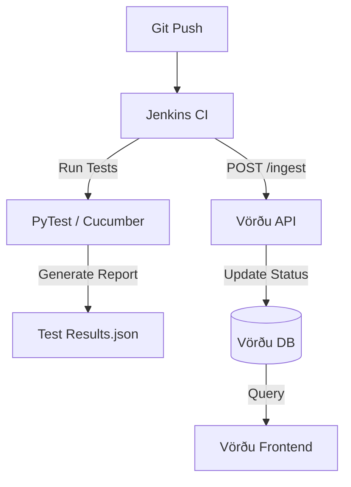

# Vörðu: The Living Roadmap Architecture
*Turning "Process as Code" into "Progress as Visuals"*

## 1. The Core Concept
Instead of manually updating a Markdown table, **Vörðu** listens to your CI/CD pipelines.
* **The Spec**: BDD Feature files (`.feature`) define *what* should work.
* **The Status**: Automated Test Results (Cucumber JSON) define *what currently* works.
* **The Map**: Vörðu aggregates this into the Matrix view.

## 2. Data Hierarchy

### A. Global Definition (Yggdrasil)
The "World Tree" defines the **Columns** (Time/Maturity) to ensure everyone speaks the same language.
* *Location*: `d:/Dev/GitWS/yggdrasil/roadmap-schema.yaml`
* *Content*:
    ```yaml
    phases:
      0: "Foundation (Norðri)"
      1: "Utility MVP"
      2: "Federation"
      3: "Sovereignty"
    ```

### B. Project Definition (The Repos)
Each project defines its **Rows** (Capabilities) and how they map to the Global Phases.
* *Location*: `[ProjectRoot]/roadmap.yaml`
* *Example (Demicracy)*:
    ```yaml
    project: "Demicracy"
    rows:
      - id: "identity"
        label: "Identity & Trust"
      - id: "governance"
        label: "Governance"
    ```

### C. Feature Mapping (The BDD Tags)
We use **Gherkin Tags** to link a specific feature to a specific cell in the matrix.
* *Syntax*: `@row:[id]` `@phase:[0-3]`
* *Example*:
    ```gherkin
    @row:identity @phase:1
    Feature: Manual Verification
      As an Admin, I want to verify a neighbor...
    ```

## 3. The Architecture



### Components
1. **Vörðu API (The Aggregator)**
    * *Tech*: Node.js / Python (FastAPI)
    * *Endpoint*: `POST /api/ingest`
    * *Payload*:
        * Project Name
        * Git Commit Hash
        * Parsed BDD Features (Tags + Pass/Fail Status)
2. **Vörðu DB (The State)**
    * *Tech*: SQLite / Postgres (or even a JSON file in Git if we want to be "GitOps" pure)
    * *Schema*: `MatrixCell { Project, Row, Phase, TotalFeatures, PassedFeatures, Status }`
3. **Vörðu UI (The Visualizer)**
    * *Tech*: React / Svelte
    * *Logic*:
        * Fetch Matrix State.
        * Render Table.
        * Cell Color = `Passed / Total`.
            * 0% = Grey (Planned)
            * 1-99% = Yellow (In Progress)
            * 100% = Green (Complete)

## 4. Workflow Example

1. **You write a feature**: `Feature: Fence Permit` tagged `@row:governance @phase:1`.
2. **You push to Git**: The test fails (Red).
3. **Vörðu updates**: The "Governance / Phase 1" cell turns **Red** (or shows "0/1 Passing").
4. **Autoboros implements it**: You write the code.
5. **Jenkins runs**: The test passes (Green).
6. **Vörðu updates**: The cell turns **Green**.

## 5. Implementation Plan (Vörðu)

* [ ] **Step 1**: Define the `roadmap-schema.yaml` in Yggdrasil.
* [ ] **Step 2**: Create the **Vörðu API** (Microservice) to parse Cucumber JSON.
* [ ] **Step 3**: Create the **Vörðu UI** to render the grid.
* [ ] **Step 4**: Wire up a sample Jenkins pipeline (using Uplifted Mascot's agent) to push data.
